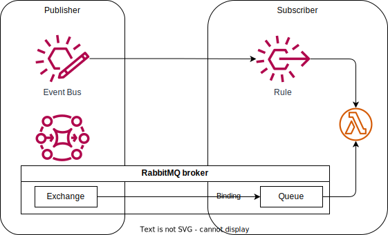

# poc-eda

A POC of Event Driven Architecture using [Amazon EventBridge](https://docs.aws.amazon.com/eventbridge/latest/userguide/eb-what-is.html)
and [Amazon MQ for RabbitMQ](https://aws.amazon.com/amazon-mq/) as pub/sub technology candidates.

This POC aims to achieve a goal that event producers are not aware of event consumers. It demonstrate
the distributed channels implementation of EDA, where the services are autonomous and do not share
common infrastructure.

There are two components/services in this POC, the publisher(pub) and the subscriber(sub), separated
by folders. The pub deploys an [EventBridge Event Bus](https://docs.aws.amazon.com/eventbridge/latest/userguide/eb-event-bus.html)
and an [RabbitMQ broker](https://docs.aws.amazon.com/amazon-mq/latest/developer-guide/working-with-rabbitmq.html)
plus a [direct exchange](https://www.rabbitmq.com/tutorials/amqp-concepts#exchange-direct) as its channels.
The sub deploys an [EventBridge rule](https://docs.aws.amazon.com/eventbridge/latest/userguide/eb-rules.html)
refers to the EventBridge Event Bus and a [queue](https://www.rabbitmq.com/tutorials/amqp-concepts#queues)
plus a [binding](https://www.rabbitmq.com/tutorials/amqp-concepts#bindings) to the exchange to listen
and filter events. Both subscriptions are handled by a Lambda function for simplicity.

## Comparison

| Feature | Amazon EventBridge | Amazon MQ for RabbitMQ |
| --- | --- | --- |
| Producer not aware of consumer | ✔️ | ✔️ 
 Although Terraform can help to decouple the infrastructure code, the queues and bindings are still physically reside in the broker. |
| Event filtering | ✔️ | Limited by routing key. |
| Event replay | ✔️ | Self-implement |
| Event monitoring | CloudWatch. Most metrics are for sub. | CloudWatch. Most metrics are broker/node metrics. Could be configured to write logs to CloudWatch. 
 RabbitMQ console. |
| Event reliability | Retries and dead letter queue | Dead letter exchange |
| Pricing | Pay-per-use | Managed instance |
